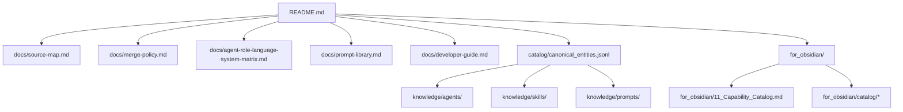

# Obsidian-Helper

Primary relationship map for using this repository inside an Obsidian vault.

Generated at: `2026-03-18T09:35:14+00:00`

## Folder Graph

## File Relationship Matrix
| File/Folder | Depends On | Purpose |
|---|---|---|
| `config/sources.yaml` | None | Defines source repositories and branches. |
| `scripts/fetch_sources.py` | `config/sources.yaml` | Downloads/extracts source archives. |
| `scripts/index_files.py` | `data/sources/*` | Creates file and binary manifests. |
| `scripts/extract_entities.py` | `data/sources/*` | Normalizes agents/skills/prompts into catalogs. |
| `scripts/build_canonical.py` | `catalog/*.jsonl` | Builds canonical merged outputs and translation audit. |
| `scripts/build_docs.py` | `catalog/*`, `knowledge/*` | Generates docs and this helper. |
| `scripts/validate_repo.py` | all generated outputs | Enforces quality gates. |
| `knowledge/agents/` | canonical catalogs | Canonical merged agent/subagent definitions. |
| `knowledge/skills/` | canonical catalogs | Canonical skill references. |
| `knowledge/prompts/` | canonical catalogs | Canonical prompt references. |
| `for_obsidian/catalog/` | canonical catalogs | User-facing capability map for Obsidian. |

## Entry Points
- Agents: `473` canonical files in `knowledge/agents/`
- Skills: `130` canonical files in `knowledge/skills/`
- Prompts: `18` canonical files in `knowledge/prompts/`

## Suggested Obsidian Vault Setup
1. Open this repository as an Obsidian vault root.
2. Pin `README.md` and `Obsidian-Helper.md` as navigation notes.
3. Use `knowledge/` for browsing canonical content and `catalog/` for machine-readable source of truth.
4. Use `docs/` when explaining merge strategy or onboarding contributors.
