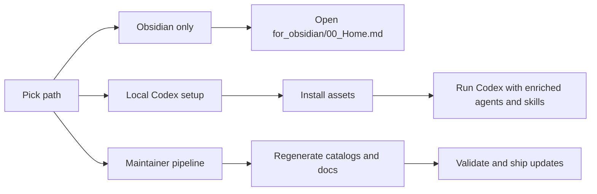
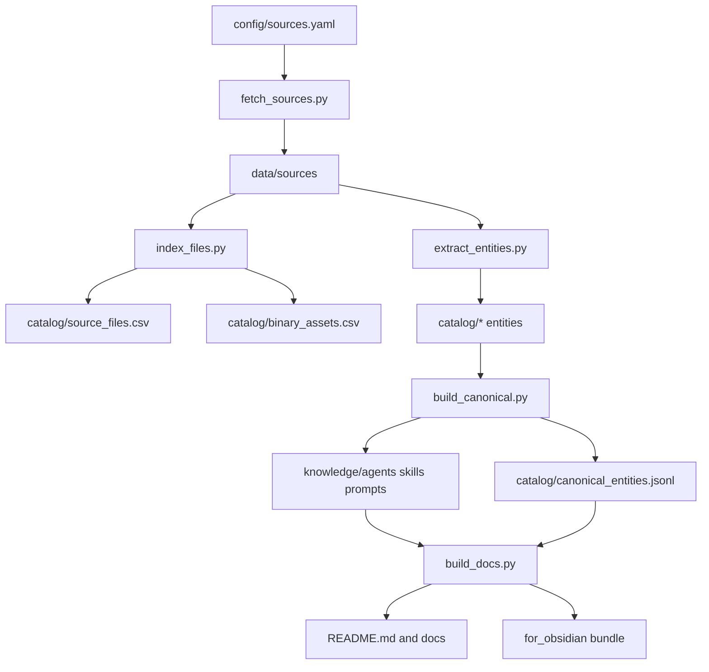
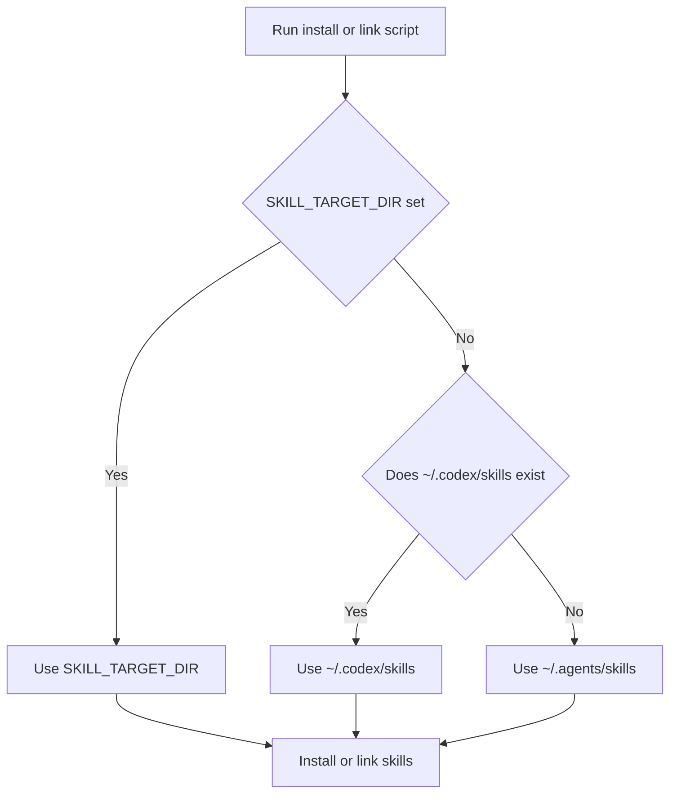

# Codex-Software-Developer

A production-ready Codex setup kit with canonical agents, skills, and an Obsidian knowledge bundle.

Use this repository to install Codex assets locally, maintain a repeatable ingestion pipeline, and ship a navigable knowledge graph for day-to-day use.

## Who This Is For
- Builders who want a copy-ready Codex setup with strong defaults.
- Maintainers who need deterministic source ingestion, canonicalization, and validation.
- Teams that want a shareable Obsidian capability map.

## Table of Contents
- [Current Snapshot](#current-snapshot)
- [Choose Your Path](#choose-your-path)
- [Quickstart Commands](#quickstart-commands)
- [When To Run Which Command](#when-to-run-which-command)
- [How It Works](#how-it-works)
- [Install Target Resolution](#install-target-resolution)
- [Repository Structure](#repository-structure)
- [Script Capabilities](#script-capabilities)
- [Taxonomy Highlights](#taxonomy-highlights)
- [Detailed Docs](#detailed-docs)

## Current Snapshot
| Metric | Value |
|---|---:|
| Source repositories configured | **5** |
| Indexed source files | **1076** |
| Indexed binary assets | **57** (indexed only, not copied) |
| Canonical agents | **473** |
| Canonical skills | **130** |
| Canonical prompts | **18** |
| Cross-repo duplicate agent names merged | **51** |

## Choose Your Path
| Path | Best for | Start here | Typical time |
|---|---|---|---|
| Obsidian only | Browse the knowledge graph without local install | Copy `for_obsidian/` and open `for_obsidian/00_Home.md` | 2-5 min |
| Local Codex setup | Install canonical + custom assets into local Codex paths | `./scripts/install_codex_helper.sh` | 5-10 min |
| Maintainer update pipeline | Add sources, rebuild canonical outputs, regenerate docs | Update `config/sources.yaml` then run pipeline scripts | 10-30 min |

## Quickstart Commands
### 1) Obsidian-only (no install)
```bash
./scripts/export_obsidian_bundle.sh "/absolute/path/to/YourObsidianVault"
```
Expected result: bundle exported to `YourObsidianVault/Codex-Helper/` and ready from `00_Home.md`.

### 2) Install assets into local Codex paths
```bash
./scripts/install_codex_helper.sh
```
Expected result: canonical + custom agents and skills are installed to resolved target directories.

### 3) Full maintainer regeneration pipeline
```bash
python3 scripts/fetch_sources.py --refresh
python3 scripts/index_files.py
python3 scripts/extract_entities.py
python3 scripts/build_canonical.py
python3 scripts/build_docs.py
python3 scripts/validate_repo.py
```
Expected result: catalogs, canonical knowledge outputs, docs, and link/integrity checks all refresh cleanly.

## When To Run Which Command
| Trigger | Command | What it changes | Key output |
|---|---|---|---|
| Added or changed source repos | `python3 scripts/fetch_sources.py --refresh` | Refreshes archives and extracted sources | `catalog/source_archives.csv` + `data/sources/*` |
| Need current file manifest | `python3 scripts/index_files.py` | Reindexes text and binary files | `catalog/source_files.csv`, `catalog/binary_assets.csv` |
| Need fresh entity extraction | `python3 scripts/extract_entities.py` | Rebuilds extracted agent/skill/prompt records | `catalog/agents.jsonl`, `catalog/skills.jsonl`, `catalog/prompts.jsonl` |
| Need canonical merged outputs | `python3 scripts/build_canonical.py` | Regenerates unified canonical entities | `knowledge/*`, `catalog/canonical_entities.jsonl` |
| Changed generator logic/docs | `python3 scripts/build_docs.py` | Regenerates README, docs, and Obsidian notes | `README.md`, `docs/*`, `for_obsidian/*` |
| Before committing updates | `python3 scripts/validate_repo.py` | Verifies source coverage, links, and consistency | Validation pass/fail report |
| First-time local asset setup | `./scripts/install_codex_helper.sh` | Copies canonical/custom assets to local Codex dirs | Installed agents/skills + optional backups |
| Active development linking | `./scripts/link_codex_helper.sh` | Symlinks assets to local Codex dirs | Live-linked agents/skills |
| Obsidian bundle refresh | `./scripts/export_obsidian_bundle.sh "<vault>"` | Copies `for_obsidian/` bundle into vault | `<vault>/Codex-Helper/` |

## How It Works
### User Journey


### Data And Build Flow


## Install Target Resolution


## Repository Structure
| Path | Purpose | When to touch it |
|---|---|---|
| `config/` | Source repository definitions | Add or remove upstream sources |
| `data/` | Downloaded archives and extracted source trees | Pipeline refresh and diagnostics |
| `catalog/` | Machine-readable manifests and extracted entities | Auditing merges and source coverage |
| `knowledge/` | Canonical merged agents, skills, and prompts | Shipping updated canonical content |
| `scripts/` | Build, install, link, export, and validation automation | Any operational workflow updates |
| `docs/` | Human-readable process and policy docs | Guidance and onboarding updates |
| `for_obsidian/` | Copy-ready Obsidian knowledge bundle | Vault export and graph browsing |
| `.codex/agents/` | Repo custom agent overlays | Custom role curation |
| `.agents/skills/` | Repo custom skill overlays | Custom skill curation |
| `templates/` | Reusable template fragments | Shared instruction/guidance templates |

## Script Capabilities
| Script | Primary use | Key flags/options | Notes |
|---|---|---|---|
| `scripts/fetch_sources.py` | Download and extract source repositories | `--refresh` | Re-downloads archives when needed |
| `scripts/index_files.py` | Build file + binary indexes | none | Requires extracted sources from fetch step |
| `scripts/extract_entities.py` | Parse and normalize entities | none | Rebuilds entity catalogs from sources |
| `scripts/build_canonical.py` | Merge and write canonical outputs | none | Produces `knowledge/*` and translation audit |
| `scripts/build_docs.py` | Regenerate README/docs/Obsidian docs | none | This script owns generated README content |
| `scripts/validate_repo.py` | Run integrity and link checks | none | Gate before commit |
| `scripts/install_codex_helper.sh` | Copy assets into local Codex paths | `--force`, `--dry-run`, `--with-global-guidance`, `--custom-only`, `--catalog-only` | Non-destructive by default with optional overwrite backup |
| `scripts/link_codex_helper.sh` | Symlink assets for active development | `--force`, `--dry-run`, `--custom-only`, `--catalog-only` | Catalog skill links use wrapper cache under `~/.codex/tmp` |
| `scripts/export_obsidian_bundle.sh` | Export Obsidian bundle | `--force`, optional bundle folder name | Copies `for_obsidian/` into vault |
| `scripts/refresh_obsidian_inventory.sh` | Rebuild markdown inventory list | none | Updates `for_obsidian/90_Markdown_Inventory.md` |

## Taxonomy Highlights
### Top Roles
| Rank | Role | Count |
|---:|---|---:|
| 1 | `expert` | 369 |
| 2 | `architect` | 230 |
| 3 | `engineer` | 117 |
| 4 | `developer` | 88 |
| 5 | `specialist` | 76 |

### Top Languages
| Rank | Language | Count |
|---:|---|---:|
| 1 | `sql` | 113 |
| 2 | `c` | 88 |
| 3 | `javascript` | 75 |
| 4 | `python` | 42 |
| 5 | `typescript` | 33 |

### Top Systems
| Rank | System | Count |
|---:|---|---:|
| 1 | `github` | 66 |
| 2 | `docker` | 56 |
| 3 | `git` | 46 |
| 4 | `kubernetes` | 33 |
| 5 | `mcp` | 32 |

## Detailed Docs
- [Source Map](docs/source-map.md)
- [Merge Policy](docs/merge-policy.md)
- [Agent Role Language System Matrix](docs/agent-role-language-system-matrix.md)
- [Prompt Library](docs/prompt-library.md)
- [Developer Guide](docs/developer-guide.md)
- [Repository Layout](docs/repo-layout.md)
- [Routing Playbook](docs/routing-playbook.md)
- [Get All Agents And Skills Locally](docs/getting-all-assets-locally.md)
- [End To End Setup](docs/how-to-codex-helper-end-to-end.md)
- [OpenAI Codex Notes](docs/latest-openai-codex-notes-2026-03-18.md)
- [Obsidian Helper](Obsidian-Helper.md)
- [Setup Helper Prompt](use_me_codex.md)
