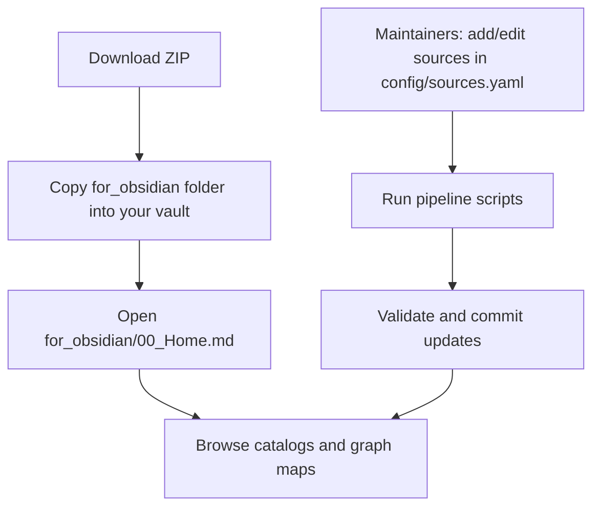

# Codex-Software-Developer

A copy-ready knowledge kit for Codex.

It collects AI agents and skills from multiple public libraries, cleans and merges them, and publishes one simple folder you can drop into Obsidian.

## What We Do (Plain Language)
- Gather many agent and skill collections in one place.
- Remove duplicates and normalize wording so the library is easier to browse.
- Build a structured knowledge base (`knowledge/`) plus a human-friendly Obsidian bundle (`for_obsidian/`).
- Keep the process repeatable with scripts so updates stay consistent.

## How We Do It (Simple + Detailed)
1. Pull configured source repositories.
2. Index every file and detect text vs binary assets.
3. Extract agents, skills, and prompts into structured records.
4. Merge duplicates into canonical outputs.
5. Generate docs and an Obsidian-ready graph folder.
6. Run validation checks before shipping.

## Current Snapshot
- Source repositories configured: **5**
- Indexed source files: **1076**
- Indexed binary assets: **57** (indexed only, not copied)
- Canonical agents: **473**
- Canonical skills: **130**
- Canonical prompts: **18**
- Cross-repo duplicate agent names merged: **51**

## Easiest Way To Use This Repo (No Commands)
1. Download the repository ZIP.
2. Copy the `for_obsidian/` folder into your Obsidian vault.
3. Open `for_obsidian/00_Home.md`.
4. For graph exploration, open `for_obsidian/graph/00_Graph_Home.md`.

## How To Add More Source Repos
Edit `config/sources.yaml` and add another entry:
```yaml
sources:
  - owner: your-org
    repo: your-repo
    branch: main
```
Then run:
```bash
python3 scripts/fetch_sources.py --refresh
python3 scripts/index_files.py
python3 scripts/extract_entities.py
python3 scripts/build_canonical.py
python3 scripts/build_docs.py
python3 scripts/validate_repo.py
```

## What Each Script Does
| Script | What it does |
|---|---|
| `scripts/fetch_sources.py` | Downloads and extracts all configured source repositories. |
| `scripts/index_files.py` | Indexes source files and tracks binary assets. |
| `scripts/extract_entities.py` | Extracts agents, skills, and prompts into normalized records. |
| `scripts/build_canonical.py` | Merges duplicates and writes canonical outputs into `knowledge/`. |
| `scripts/build_docs.py` | Regenerates `README.md`, docs, and the Obsidian bundle notes. |
| `scripts/validate_repo.py` | Runs integrity checks across indexes, outputs, and links. |
| `scripts/refresh_obsidian_inventory.sh` | Refreshes Obsidian markdown inventory. |
| `scripts/export_obsidian_bundle.sh` | Copies `for_obsidian/` into a target vault folder. |
| `scripts/install_codex_helper.sh` | Installs local agent and skill assets for Codex usage. |
| `scripts/link_codex_helper.sh` | Symlink-based install mode for local development. |

## How To Use This Repo (Diagram)


## Repository Layout
```text
config/                 # source definitions
scripts/                # reproducible build/index/validate pipeline
catalog/                # machine-readable manifests and normalized contracts
knowledge/agents/       # canonical merged agent TOMLs
knowledge/skills/       # canonical skill markdown
knowledge/prompts/      # canonical prompt markdown
for_obsidian/           # copy-ready vault folder
docs/                   # source map, merge policy, matrix, guide
Obsidian-Helper.md      # vault-first relationship guide
```

## Taxonomy Highlights
- Top roles: expert, architect, engineer, developer, specialist, manager, admin, reviewer
- Top languages: sql, c, javascript, python, typescript, swift, react, java

## Detailed Docs
- [Source Map](docs/source-map.md)
- [Merge Policy](docs/merge-policy.md)
- [Agent Role Language System Matrix](docs/agent-role-language-system-matrix.md)
- [Prompt Library](docs/prompt-library.md)
- [Developer Guide](docs/developer-guide.md)
- [Obsidian Helper](Obsidian-Helper.md)
