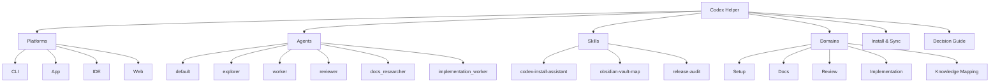
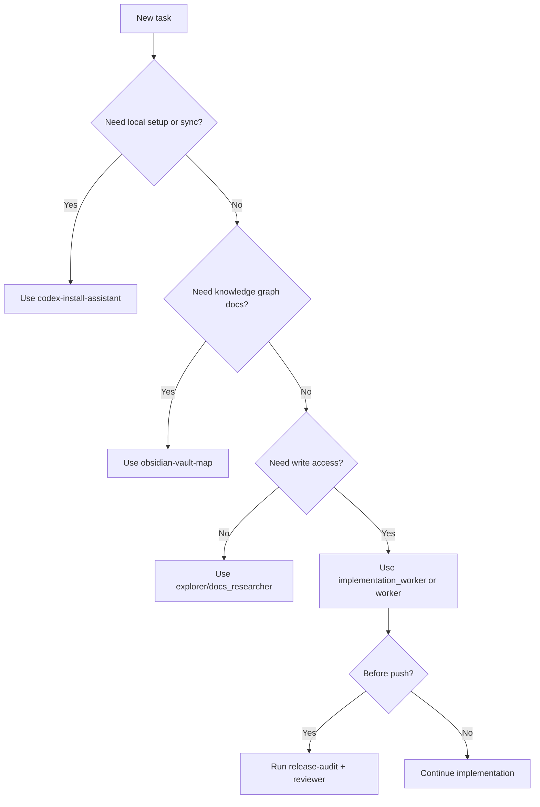

# Diagrams

## Capability graph

```mermaid
graph TD
  A["Codex Helper"] --> B["Platforms"]
  A --> C["Agents"]
  A --> D["Skills"]
  A --> E["Domains"]
  A --> F["Install & Sync"]
  A --> G["Decision Guide"]

  B --> B1["CLI"]
  B --> B2["App"]
  B --> B3["IDE"]
  B --> B4["Web"]

  C --> C1["default"]
  C --> C2["explorer"]
  C --> C3["worker"]
  C --> C4["reviewer"]
  C --> C5["docs_researcher"]
  C --> C6["implementation_worker"]

  D --> D1["codex-install-assistant"]
  D --> D2["obsidian-vault-map"]
  D --> D3["release-audit"]

  E --> E1["Setup"]
  E --> E2["Docs"]
  E --> E3["Review"]
  E --> E4["Implementation"]
  E --> E5["Knowledge Mapping"]
```

## Selection flow

```mermaid
flowchart TD
  S["New task"] --> Q1{"Need local setup or sync?"}
  Q1 -->|Yes| I["Use codex-install-assistant"]
  Q1 -->|No| Q2{"Need knowledge graph docs?"}
  Q2 -->|Yes| O["Use obsidian-vault-map"]
  Q2 -->|No| Q3{"Need write access?"}
  Q3 -->|No| X["Use explorer/docs_researcher"]
  Q3 -->|Yes| W["Use implementation_worker or worker"]
  W --> R{"Before push?"}
  R -->|Yes| V["Run release-audit + reviewer"]
  R -->|No| E["Continue implementation"]
```
