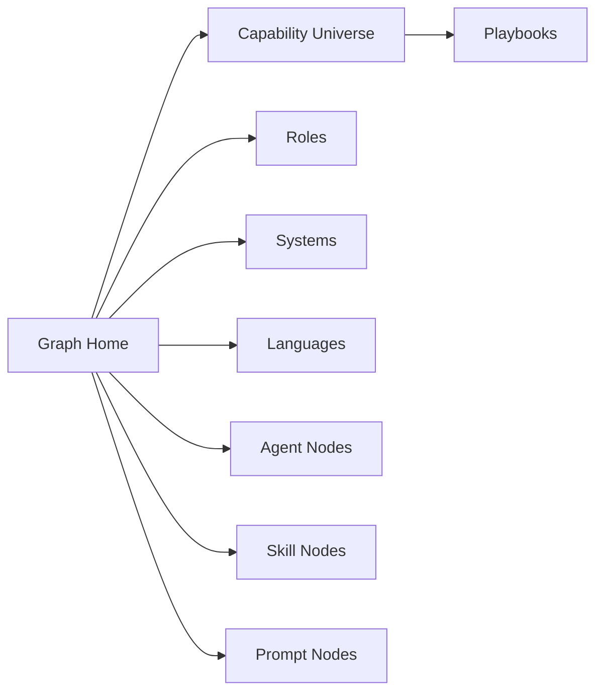

# Graph Home

Generated at: `2026-03-18T09:35:14+00:00`

This graph-first section is optimized for Obsidian exploration.

## Start points

| View | Link |
|---|---|
| Capability universe map | [[graph/maps/capability-universe]] |
| Roles map | [[graph/maps/by-role]] |
| Systems map | [[graph/maps/by-system]] |
| Languages map | [[graph/maps/by-language]] |
| Agent nodes | [[graph/agents/_index]] (473 notes) |
| Skill nodes | [[graph/skills/_index]] (130 notes) |
| Prompt nodes | [[graph/prompts/_index]] (18 notes) |

## High-value playbooks
- [[graph/playbooks/frontend-developer|Frontend Developer]]
- [[graph/playbooks/backend-developer|Backend Developer]]
- [[graph/playbooks/devops-and-cloud|DevOps And Cloud]]
- [[graph/playbooks/data-and-ml|Data And ML]]
- [[graph/playbooks/security-and-review|Security And Review]]
- [[graph/playbooks/mobile-ios-android|Mobile iOS Android]]

## Linked views
- [[00_Home]]
- [[11_Capability_Catalog]]

## Universe graph

