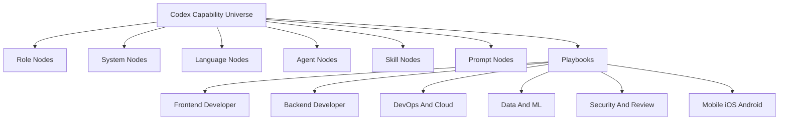

# Capability Universe

Generated at: `2026-03-18T19:34:59+00:00`

```mermaid
graph TD
  A["Codex Capability Universe"] --> B["Role Nodes"]
  A --> C["System Nodes"]
  A --> D["Language Nodes"]
  A --> E["Agent Nodes"]
  A --> F["Skill Nodes"]
  A --> G["Prompt Nodes"]
  A --> H["Playbooks"]
  H --> P_frontend_developer["Frontend Developer"]
  H --> P_backend_developer["Backend Developer"]
  H --> P_devops_and_cloud["DevOps And Cloud"]
  H --> P_data_and_ml["Data And ML"]
  H --> P_security_and_review["Security And Review"]
  H --> P_mobile_ios_android["Mobile iOS Android"]
```

## Linked views
- [[graph/00_Graph_Home]]
- [[graph/maps/by-role]]
- [[graph/maps/by-system]]
- [[graph/maps/by-language]]
